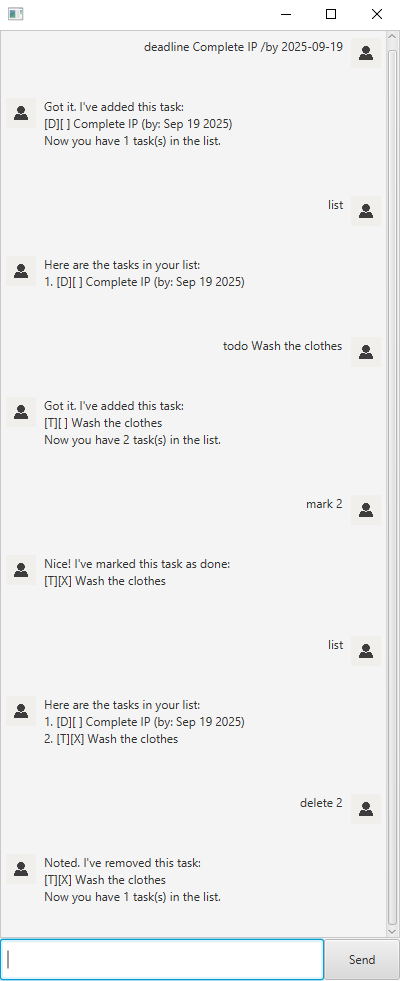

# Marquess User Guide

Marquess is a simple and efficient desktop CLI tool designed to help users manage and 
organise their tasks. With an easy-to-use syntax, Marquess can help you write your todo
lists as fast as ever before!

## Quick Start
1. Download the latest release from the [Releases](https://github.com/ngjsjordan/ip/releases) section.
2. Double-click the jar file and get started!

## Features

### Listing Tasks: `list`

Displays all tasks that have been added to the list.

Format: `list`

### Adding Tasks: `todo`, `deadline`, `event`

Adds each type of task to the list:
- Todo tasks are basic tasks with only a description.
- Deadline tasks have a description and a deadline date.
- Event tasks have a description and a specific start and end date.

Usage:
- Todo: `todo <description>`
- Deadline: `deadline <description> /by <date>`
- Event: `event <description> /from <start date> /to <end date`

Note: Dates should be in the format `YYYY-MM-DD`.

### Marking Tasks: `mark`, `unmark`

Marks or unmarks a task as completed. Task indices can be obtained
from the `list` command. Supports multiple marks/unmarks in one command.

Usage:
- Mark: `mark <task index> [<task index> ...]`
- Unmark: `unmark <task index> [<task index> ...]`

### Deleting Tasks: `delete`

Deletes a task from the list. Task indices can be obtained
from the `list` command. Supports multiple deletes in one command.

Usage:
- Delete: `delete <task index> [<task index> ...]`

### Finding Tasks: `find`

Searches for tasks that contain a specific substring in their description.
Displays a list of matching tasks.

Usage:
- Find: `find <substring>`